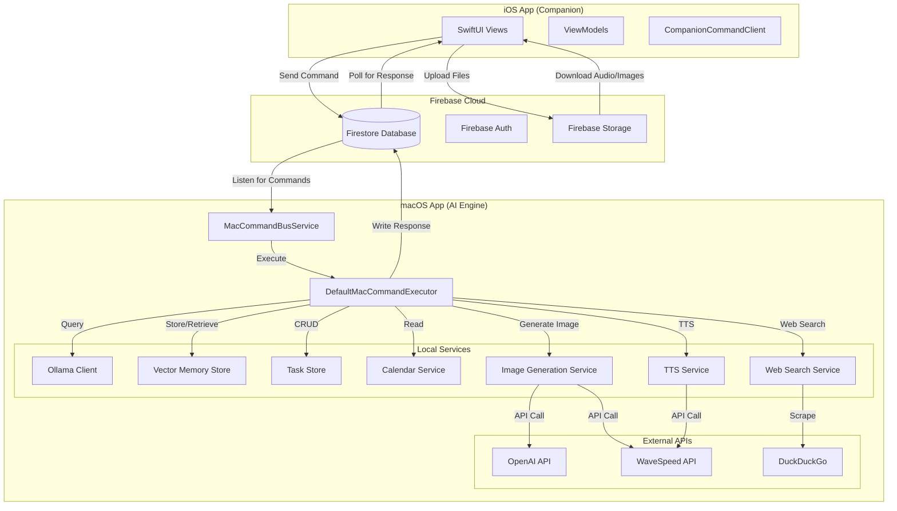

# 🧠 Astra Assistant

**Your own AI helper that stays private and works on your Mac, with a friend app for your iPhone.**

[](https://github.com/Alexnnn/AstraAssistant) [](LICENSE) [](https://swift.org)


---

## ✨ Features

This project is packed with cool features to make your life easier!

- **Run AI Locally:** You can use awesome AI models like Qwen2.5, Llama3.2 Vision, and Nomic-Embed right on your computer using Ollama.
- **Control from Your iPhone:** There's a special app for your iPhone that lets you control your Mac, no matter where you are.
- **Talk to Your Computer:** You can use your voice to tell the computer what to do (Speech-to-Text) and have it talk back to you (Text-to-Speech). It works with macOS, WaveSpeed, and Qwen3.
- **Create and Edit Images:** Make amazing pictures using AI! You can use OpenAI DALL-E or WaveSpeed Seedream for this.
- **Remember Things:** The app has a "long-term memory" feature. It uses special tech (vector embeddings) to remember your personal information and use it to help you better.
- **Manage Your Tasks and Schedule:** Keep track of your to-do lists and your calendar. It works locally and can connect with your iCal.
- **Search the Web Smartly:** Find information online using DuckDuckGo. The AI helps figure out the best way to search for you.
- **Analyze Your Screen:** Take pictures of your Mac screen and let the AI figure out what's on it.
- **Summarize Files:** Quickly get the main points from your files, like PDFs, TXT, JSON, CSV, and Markdown documents.

---

## 🏗️ Architecture





## How it works

- **iOS app** sends commands to Firebase Firestore
- **macOS app** listens for commands and executes them
- **macOS app** writes results back to Firebase
- **iOS app** receives results and displays them


## 🚀 Quick Start

To get started quickly, here's what you'll need and the first step:

### Prerequisites

Before you begin, please make sure you have the following:

- **For the Mac app:** Your Mac should be running macOS 14 (Sonoma) or newer.
- **For the iPhone app:** Your iPhone needs to have iOS 17 or newer.
- **Ollama:** You need to have Ollama installed on your Mac. You can get it from [Ollama's website](https://ollama.com).
- **Firebase Account:** You'll need a Firebase account. The free tier is perfectly fine to use.

### 1. Clone the repository

First, let's get a copy of the project on your computer. Open your terminal or command prompt and run the following command:


```bash
git clone https://github.com/Alexnnn/AstraAssistant.git
cd AstraAssistant
```


### 2. Setting Up Firebase

To get started with Firebase, follow these simple steps:

1. **Go to the Firebase Console:** Open your web browser and navigate to the [Firebase Console](https://console.firebase.google.com/).
2. **Create a New Project:** Click on the "Add project" button and follow the on-screen instructions to create a new project for your app.
3. **Add Your Apps:** Once your project is created, you'll need to add your iOS and macOS applications to it. Look for the "Add app" option and select the appropriate platform.
4. **Enable Anonymous Authentication:** This is an important step! Go to the "Authentication" section in your Firebase project. Then, under "Sign-in methods," find and enable "Anonymous" authentication. This allows users to sign in without needing an email or password.
5. **Download Configuration Files:** For each app you added (iOS and macOS), download the `GoogleService-Info.plist` file. You'll find this option after adding your app.
6. **Add to Xcode:** Drag and drop the downloaded `GoogleService-Info.plist` file into the main folder of your Xcode project for each respective app. Make sure to check the box for your app target when prompted.


### 3. Install Ollama Models

To start using Ollama, you'll need to download some models. It's a simple process! First, open your terminal. If you don't know what that is, it's like a text-based window where you type commands for your computer.

Here's what you need to do:

1. **Start Ollama:** In one terminal window, type the following command and press Enter:

   ```bash
   ollama serve
   ```

   This keeps Ollama running in the background.

2. **Download Models:** Now, open a *new* terminal window. You'll use this one to download the models you want. Here are some examples:

   ```bash
   # To download a chat model like Qwen 2.5 (14 billion parameters):
   ollama pull qwen2.5:14b
   
   # To download a model for creating text memories (embeddings):
   ollama pull nomic-embed-text
   
   # To download a model that can understand images:
   ollama pull llama3.2-vision
   ```

When you run a command like `ollama pull <model-name>`, it downloads the specified model. If you're not sure which models to choose, you can explore the [Ollama library](https://ollama.ai/library) to see all the available options. Just pick the one you like and use its name in the `pull` command!


### 4. Run the Apps

To get started, let's run both the main Astra AI Assistant and its companion app.

1. **Astra AI Assistant:**

   - First, open the `AstraAI/Astra AI Assistant.xcodeproj` file. You can usually find this in your project folder.
   - Once it's open in Xcode, simply click the "Build and Run" button (it often looks like a play icon).

2. **Astra Companion App:**

   - Next, open the `AstraCompanion/AstraCompanion.xcodeproj` file.
   - Build and run this project. Make sure you select an iPhone simulator or a connected iPhone device to run it on.


## 📱 Usage

### Pairing Your iPhone with Your Mac

Connecting your iPhone to your Mac is super simple! Just follow these easy steps:

1. **On your Mac:** Go to `Settings` &gt; `iPhone / iPad Pairing` and click on `Generate Code`.
2. **On your iPhone:** You'll see a code on your Mac. Either type the 6-digit code into your iPhone or just scan the QR code that appears.
3. That's it! Your devices are now linked up and ready to go. 🎉


### Chat Commands

Here's a list of commands you can use in the chat:

- `/help`: This command shows you all the commands you can use.
- `/search <query>`: Use this to search the web for something. Just replace `<query>` with what you want to find.
- `/task <text>`: This command lets you add a new task. Type your task after `/task `.
- `/tasks`: Want to see what tasks you still need to do? Use this command.
- `/calendar today`: This will show you all the events scheduled for today.
- `/calendar add YYYY-MM-DD HH:mm | Title`: Use this to add a new event to your calendar. Make sure to put the date, time, and title in the right format, like `/calendar add 2023-10-27 14:00 | Meeting with Team`.
- `/now`: This command tells you the current date and time.


### Voice Modes

This feature lets you control how you interact with the voice assistant. You can choose the best way for you:

- **Manual:** Just press the button to start and stop listening. It's like a simple walkie-talkie.
- **Push-to-Talk:** Press and hold the button while you want to speak. Let go, and it stops listening. This is great for quick commands.
- **Hold-to-Talk:** Press and hold the button to speak, and then release it when you're done. The assistant will send your message after you release the button.
- **Continuous:** The assistant is always listening, so you can talk to it anytime without pressing a button.
- **Wake Phrase:** You can wake up the assistant by saying "Astra" or a special phrase you set yourself. It will only listen after you say the wake phrase.


## 🔧 Configuration

This section explains how to set up the different services your project can use. Think of it like choosing the tools you want to use for specific jobs.

### Voice TTS Providers (Text-to-Speech)

This is how your project can speak out loud. You have a few options:

- **macOS Built-in Voices:** These are voices that come with your Mac. They are super fast because they don't need to connect to the internet.
- **WaveSpeed Qwen3:** This uses an online service (an API) that can even copy voices (voice cloning).
- **Local Qwen3:** You can run this voice service right on your Mac using Python. This means it works offline.

### Image Providers

This is how your project can create images. You'll need an API key for these, which is like a secret password for using their services:

- **OpenAI (DALL-E / GPT-Image):** Uses OpenAI's powerful image generation models.
- **WaveSpeed Seedream (v4.5 / v5.0 Pro):** Uses WaveSpeed's own image creation technology.


## 🧪 Diagnostics

Run diagnostics in Settings → "Run Diagnostics" to verify:

✅ Ollama is running

✅ Required models are installed

✅ Microphone & Speech permissions

✅ API keys are configured (if using cloud services)


## 📄 License

This project is open-source and available under the **MIT License**. You can find all the specifics in the `LICENSE` file included in this repository. This means you're free to use, modify, and distribute the code as you wish, as long as you keep the original license notice intact.


## 🙏 Acknowledgements

We want to give a big thank you to the amazing tools and services that helped make this project possible!

- **Ollama:** This is our go-to for running large language models right on your computer. It makes things super fast and easy!
- **Firebase:** We used Firebase for handling user communication and making sure everyone can sign in securely. It's a lifesaver!
- **WaveSpeed:** For creating cool text-to-speech voices and generating images, WaveSpeed's API was a huge help.
- **DuckDuckGo:** We relied on DuckDuckGo for searching the web to gather information.

We couldn't have done it without them!


## 🤝 Contributing

Want to help make this project even better? That's awesome! Here's a simple guide to get you started:

1. **Fork the Repository:** Click the "Fork" button at the top of the page. This creates your own copy of the project.
2. **Create a New Branch:** Make a new branch for your changes. It's like creating a separate workspace so you don't mess with the main code. Use this command: `git checkout -b your-new-feature-name`
3. **Make Your Changes:** Add your cool new feature or fix a bug. When you're happy with it, save your work by committing it. Use this command: `git commit -m 'Add a description of your changes'`
4. **Share Your Changes:** Upload your branch to your forked repository using: `git push origin your-new-feature-name`
5. **Open a Pull Request:** Head back to the original repository and you'll see an option to create a "Pull Request." This is where you show us your amazing work, and we can review it together!


## 📬 Contact

Maintainer: [Alexnnn](mailto:alex@sunteame.com)
Project Link: <https://github.com/Alexnnn/AstraAssistant>
Website: [sunteame.com](https://sunteame.com/)


Built with ❤️ using SwiftUI.